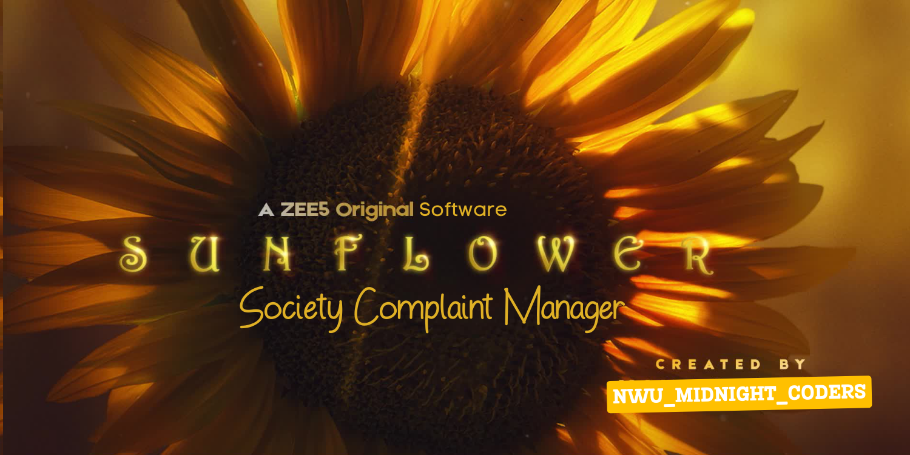

# Sunflower Complaint Management System


*(Note: This image is `a.png`, it is the main landing screen image, and it is collected from Google Images by a ZEE5 series named "Sunflower". I just used the image as a background; you can have it or change it. No intention of promoting anything)*

A basic complaint management system built with Python, Tkinter, and SQLite, originally developed as a university lab project. This desktop application provides a simple interface for users to submit complaints and for administrators to view and manage complaint records.

## Motivation
The goal of this project was to create an easy-to-use system for handling complaints within a community. It provides a simple and intuitive interface for users to submit complaints, and for administrators to review and manage them.

## Table of Contents

-   [Features](#features)
-   [Technologies Used](#technologies-used)
-   [Prerequisites](#prerequisites)
-   [Installation & Setup](#installation--setup)
-   [Usage](#usage)
-   [Project Structure](#project-structure)
-   [Configuration](#configuration)
-   [Contributing](#contributing)
-   [License](#license)
-   [Acknowledgments](#acknowledgments)

## Features

*   **GUI-based Complaint Submission**: Users can submit complaints through an intuitive graphical user interface form.
*   **Local Data Storage**: Complaint data is securely stored in a local SQLite database (`complaintDB.db`).
*   **Admin Complaint Listing**: Administrators can view all submitted complaints in a sortable and readable table format.
*   **Separate User/Admin Views**: Distinct interfaces for complaint submission (user) and complaint review (admin).
*   **Image-based Landing Screen**: A visually appealing initial screen upon launching the application.
*   **Robust Database Handling**: Uses `configdb.py` to manage database connections, table creation, and data insertion.

## Technologies Used

*   **Languages**:
    *   Python
*   **Libraries/Frameworks**:
    *   **Tkinter**: Standard Python GUI toolkit for building the desktop application interface.
    *   **SQLite3**: Python's built-in module for working with SQLite databases.
    *   **Pillow (PIL Fork)**: Used for image processing, likely for handling the landing screen image (`assets/a.png`).

## Prerequisites

Before you begin, ensure you have the following installed on your system:

*   **Python 3.x**: The project is built with Python. You can download it from [python.org](https://www.python.org/downloads/).
    *   Tkinter is usually included with standard Python installations.
    *   SQLite3 is also built-in with Python.

## Installation & Setup

Follow these steps to get the project up and running on your local machine:

1.  **Clone the repository**:
    ```bash
    git clone https://github.com/aka-assB0T/sunflower_complaint_management_system.git
    cd sunflower_complaint_management_system
    ```

2.  **Create a virtual environment** (recommended):
    ```bash
    python -m venv venv
    ```

3.  **Activate the virtual environment**:
    *   **On Windows**:
        ```bash
        .\venv\Scripts\activate
        ```
    *   **On macOS/Linux**:
        ```bash
        source venv/bin/activate
        ```

4.  **Install the required dependencies**:
    ```bash
    pip install -r requirements.txt
    ```

## Usage

To run the application, simply execute the `main.py` file:

```bash
python main.py
```

Upon launching:

1.  An initial splash screen (using `assets/a.png`) will appear.
2.  You will then be presented with options, typically to either submit a complaint or log in as an administrator to view existing complaints.
3.  **To submit a complaint**: Fill out the form fields (First Name, Last Name, Address, Gender, Comment) and click the submit button.
4.  **To view complaints (Admin)**: Select the admin option, which will display a table populated with all complaints stored in `complaintDB.db`.

## Project Structure

```
.
├── .gitignore               # Specifies intentionally untracked files to ignore
├── README.md                # This README file
├── assets/                  # Directory for project assets like images
│   └── a.png                # Landing screen image or application icon
├── complaintListing.py      # Module for displaying and managing the list of complaints (Admin view)
├── configdb.py              # Module for database connection, table creation, and CRUD operations
├── main.py                  # Main application entry point, handles UI setup and navigation
└── requirements.txt         # Lists Python dependencies
```

## Configuration

*   **Database File**: The application automatically creates an SQLite database file named `complaintDB.db` in the project root directory if it doesn't already exist.
*   **Database Schema**: The `complainTable` schema (ID, FirstName, LastName, Address, Gender, Comment) is defined and managed within `configdb.py`. Modifications to the table structure should be made there.
*   **UI Settings**: Basic UI configurations such as window geometry, titles, and background colors are set within `main.py` and `complaintListing.py`.
*   **Image Assets**: The `assets/` directory holds images used by the application, with `a.png` serving as a primary visual element.

## Contributing

Contributions are welcome! If you'd like to contribute, please follow these steps:

1.  **Fork** the repository.
2.  **Create a new branch** for your feature or bug fix: `git checkout -b feature/your-feature-name`.
3.  **Implement** your changes.
4.  **Commit** your changes with a clear and descriptive message: `git commit -m "feat: Add new feature X"` or `git commit -m "fix: Resolve bug Y"`.
5.  **Push** your branch to your forked repository: `git push origin feature/your-feature-name`.
6.  **Open a Pull Request** to the `main` branch of this repository.

Please ensure your code adheres to PEP 8 style guidelines.


### **Screenshots**
Why not run and see yourself?


## License
This project is licensed under the MIT License - see the [LICENSE](./assets/LICENSE) file for details.


## Future Enhancements
- Add user authentication to allow for multiple user roles (admin/user).
- Allow users to track the status of their complaints.
- Improve the GUI with better visuals.


## Acknowledgments

*   This project was developed as a university (North Western University, Khulna) lab project by [aka-assB0T](https://github.com/aka-assB0T).
